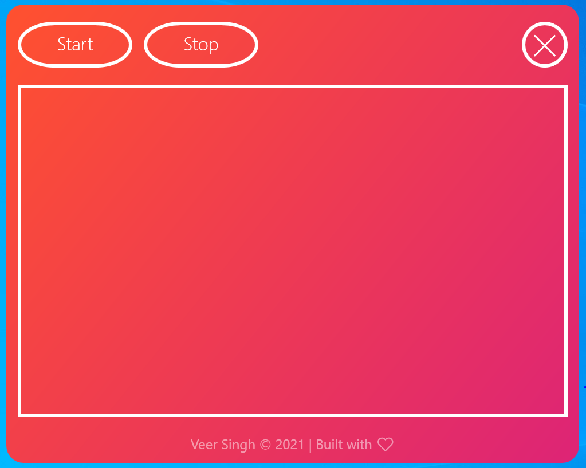
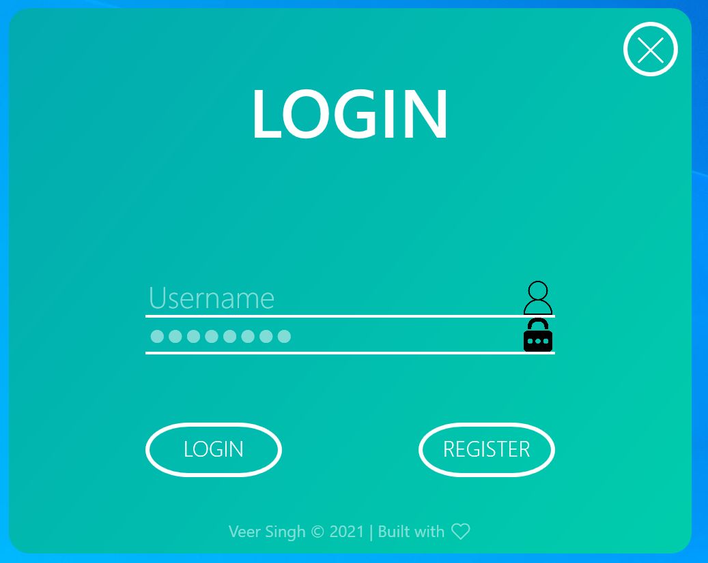
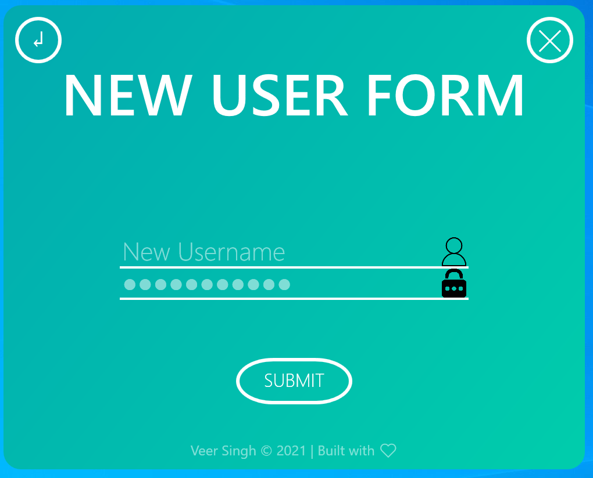
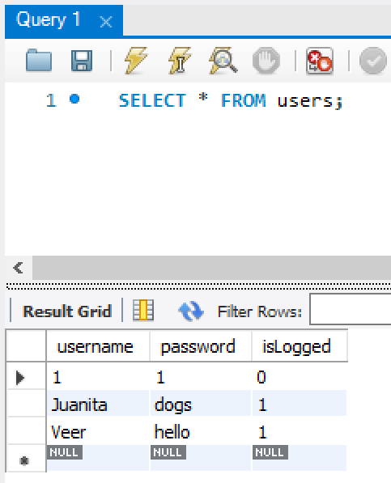
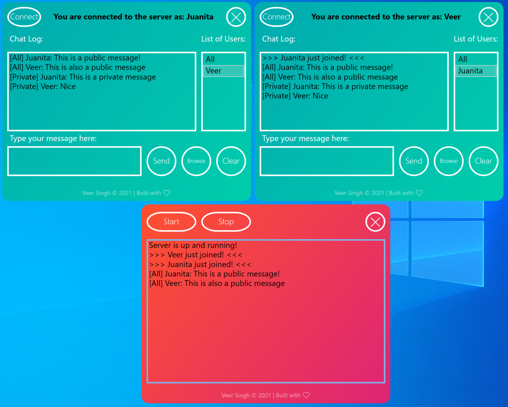
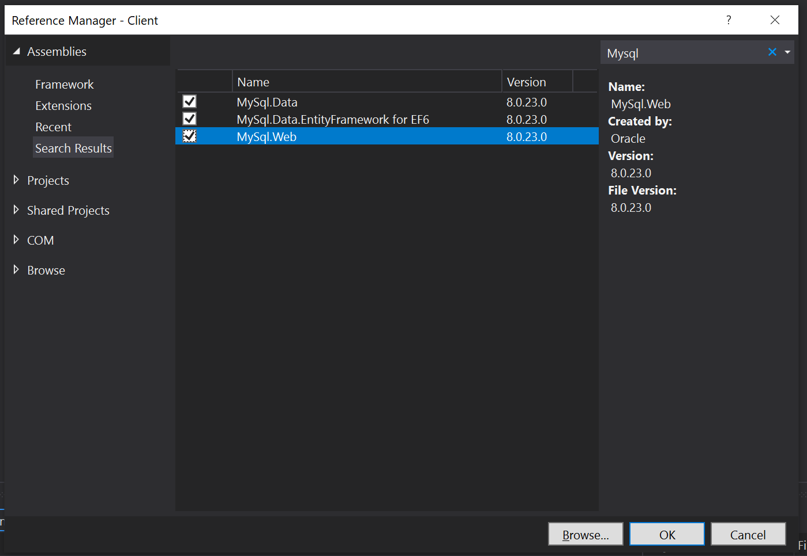
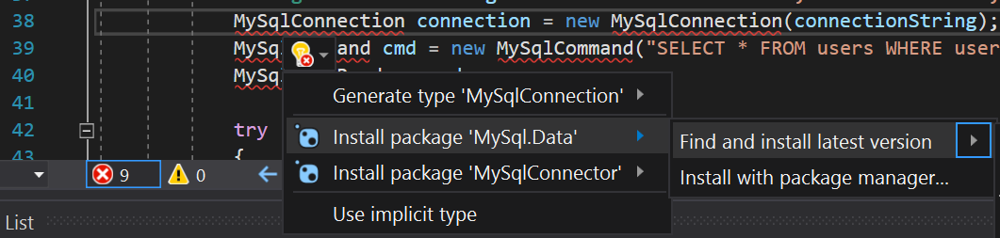

# Chat-application
This is a wpf chat application. It lets users make accounts and log into their accounts to connect to a server. The server keeps a log of everyone who has entered and left the chat room. The users recieve a list of all other users also on the same server. The users can choose "All" which broadcasts the message to everyone, including the server log or users can send private messages to other users. These private messages are not tracked by even the server. The users are also allowed to send files to other users. The clear button lets the user clear the chat log. As and when people log in and out, the other users currently on the server are also updated about it. This chat application uses a local MySQL database to store the username, password and log in info. I use [SimpleTcp](https://github.com/BrandonPotter/SimpleTCP) for TCP sockets.

## Some screenshots
Server
<p align="left">
  
</p>

Login Page
<p align="left">
  
</p>

New User Form
<p align="left">
  
</p>

Database Image - As we can see once we create users, we can check their username, password and their login.
<p align="left">
  
</p>

Public and Private messages
<p align="left">
  
</p>

## Chat application Video
[](https://www.youtube.com/watch?v=5KWcnVNVr5Q)

## Requirements
- [Visual Studio 2019 Community](https://visualstudio.microsoft.com/downloads/) - Download and install this free IDE, with the .NET desktop development workload. 
- [MySQL](https://dev.mysql.com/downloads/) - Download and install the MySQL installer for Windows and do the "Full" installation. Otherwise make sure you have the MySQL Connectors -> Connector/NET. Make sure port 3306 is not already in use, if it is in use you will have to reconfigure settings in the MySQL Installer. You can check if port 3306 is being used and by what by Win+R -> resmon.exe -> Network -> Listening Ports.
  
## Guide to Download and Run this Project
- Download the project with ``` git clone ___ ``` or download the .zip file
- Open the ```Client.sln``` file
- Build the entire solution. This will build both Client and Server.
- If you run into issues, it is most likely that the ```MySql``` reference is not working
- To fix this, right click Client -> Add -> Reference... -> Search -> MySql and select all and press Ok (as shown in the image)
<p align="left">
  
</p>

- Now go to MainWindow.xaml.cs under Client and go to line **38** ```MySqlConnection connection = new MySqlConnection(connectionString);```
- ```MySqlConnection``` should be underlined with red, click on it and then click on the yellow bulb
- Click on the provided solution for this issue, -> ```Find and install latest version``` (as shown in the image)  

<p align="left">
  
</p>

- This should fix this issue
- Now build Solution again
- The Client.exe will be stored under ```Chat-application\Client\bin\Debug``` folder
- The Server.exe will be stored under ```Chat-application\Server\bin\Debug``` folder
- You wont be able to use the chat application unless you setup the following database in the next step

## Setting up a local MySQL database
- After the successful installation of MySQL, configure the root password. For me i set it as 1234. We will need this password when sending MySQL commands.  
Now we have to set up a local database. To do that open MySQL Workbench, go to the "Local instance MySQL80" under MySQL Connections. Here we can write SQL queries to make the database.  
```
CREATE DATABASE loginnames;
```
- This creates the database
```
USE loginnames;
```
- This tells SQL to use this database for all commands
```
CREATE TABLE users (username VARCHAR(255) PRIMARY KEY NOT NULL, password VARCHAR(255), isLogged VARCHAR(1));
```
- This creates a new table called users where we have 3 columns called username, password and isLogged, all of which are the type varchar. The username is Primary Key which means we can never have a duplicate username.
```
SELECT * FROM users;
```
- We can use this statement to check if the table is created properly. Our local database is ready.  
- Make sure the password, datasource name,username, name of the database, table and columns is same and also the order of columns. If you change the name of any of these you will have to manually change the SQL command in the code in the Client project in ```MainWindow.xaml.cs```, ```NewUserForm.xaml.cs``` and ```ChatWindow.xaml.cs```

## Running the application
I have created 3 batch files
- ```Both.bat``` - Open 2 instances of the Client.exe and one instance of the Server.exe
- ```Client.bat``` - Opens one instance of the Client.exe
- ```Server.bat``` - Opens one instance of the Server.exe
- You can also manually go inside the ```Chat-application\Client\bin\Debug``` or ```Chat-application\Server\bin\Debug``` folders and open these .exe files, but using the batch files is easier.

## Miscellaneous
- [Icons for client and server](https://iconarchive.com/)  
- [Background gradient ideas](https://digitalsynopsis.com/design/beautiful-color-ui-gradients-backgrounds/)
